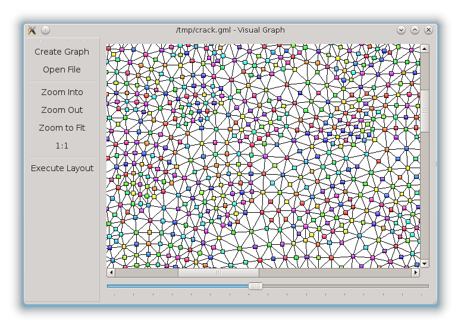

VisualGraph
================================================================================

Welcome to VisualGraph, a viewer for the Open Graph Drawing Framework (OGDF).

Modules
--------------------------------------------------------------------------------

### VisualGraph

Viewer for Linux and Windows using the QT-Library.

### oggl

Library for rendering very big OGDF graphs with OpenGL. A decent graphic card 
should render 1,000,000 nodes smoothly (don't try it with a debug build).

### oggl-test

Test project for oggl.

### glut_app

Lightweight graph viewer using GLUT.

Prerequisites
--------------------------------------------------------------------------------

* OGDF
* QT4
* OpenGL 3.3
* cmake 2.6 or higher

Linux

* gcc 4.7 or higher

Windows

* Visual Studio 2010 or higher

Build
--------------------------------------------------------------------------------

VisualGraph uses cmake as meta build system, cmake generates on Linux a 
Makefile and on Windows a Visual Studio solution. 

### Building on Linux

	$ cd <VisualGraph root directory>
	$ mkdir build
	$ cd build
	$ cmake ..
	$ make

If you use a nVidia graphic card, you need the nVidia proprietary driver, because 
the Nouveau driver does not support accelerated OpenGL.

### Building on Windows

	> cd <VisualGraph root directory>
	> mkdir build
	> cd build
	> cmake ..

The solution VisualGraph.sln should now be in the build directory.

You can use Visual Studio 2012 but Platform Toolset has to be 
"Visual Studio 2010 (v100)" (because QT4 is builded with VS2010).

If the QT DLLs are not in the path, copy the relevant DLLs side by side to 
VisualGraph.exe:

	Debug build:   QtCored4.dll, QtGuid4.dll, QtOpenGLd4.dll
	Release build: QtCore4.dll,  QtGui4.dll,  QtOpenGL4.dll

### OGDF library

OGDF and VisualGraph directories should be in the same parent directory, so that
cmake can find the OGDF include directoy and the library automatically.

If the OGDF library is not found by cmake, issue the following commandline with 
the full paths to your OGDF:

On Linux:

	$ cmake -DOGDF_INCLUDE_DIR:PATH=<full path to OGDF include director> \
		-DOGDF_LIBRARY:FILEPATH=<full path to OGDF library> ..

On Windows:

	> cmake -DOGDF_INCLUDE_DIR:PATH=<full path to OGDF include director> \
		-DOGDF_DEBUG_LIBRARY:FILEPATH=<full path to OGDF DEBUG library> \
		-DOGDF_RELEASE_LIBRARY:FILEPATH=<full path to OGDF RELEASE library> \
		..

LICENSE
--------------------------------------------------------------------------------

The GL Load library in the directory VisualGraph/oggl/glload is distributed 
under the MIT License.

The other parts of the software are distributed under the terms of the 
[GPLv3](<http://www.gnu.org/licenses/gpl-3.0.html>), in addition all special 
exceptions of the OGDF are allowed, see 
OGDF License <http://www.ogdf.net/doku.php/tech:license>. By using this 
software you agree to these license terms.

COPYRIGHT
--------------------------------------------------------------------------------

All files in the VisualGraph distribution are copyrighted.

All files with the exception of the GL Load library:

Copyright (C) 2013 The VisualGraph Authors
